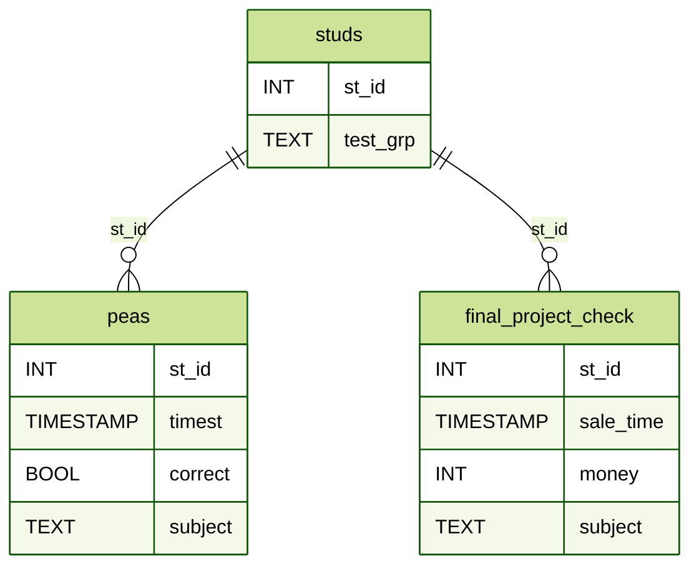

## A/B–тестирование

В ходе тестирования одной гипотезы целевой группе была предложена новая механика оплаты услуг на сайте, у контрольной группы оставалась базовая механика.

Поставлена задача проанализировать итоги эксперимента и сделать вывод, стоит ли запускать новую механику оплаты на всех пользователей.


Процесс оплаты происходит в тот момент, когда корзина пользователя уже сформирована.
* не должно повлиять на ARPPU
* не должно повлиять на CR в активного пользователя
* упростит процесс оплаты, в результате чего увеличится конверсия активного пользователя в покупку.

### Выбранные метрики
* **СR в покупку** - целевая метрика
* **ARPAU** и **ARPU** - *Guardrail* метрики, т.к. *CR в покупку* влияет на них
* **ARPPU** и **CR в активного пользователя** следим, чтобы не отличались между группами


### Выводы
* В тестовой группе обнаружено аномально высокое количество покупок в 1900 руб.
* **CR в активного пользователя** статистически значимо увеличился в тестовой группе
<br>Могло быть вызвано:
  * Акцией из предыдущего пункта (если акция была рассылкой) 
  * Сломанной сплит-системой
* **ARPPU** статистически значимо увеличился в тестовой группе (за счет аномальных значений из первого пункта)
* Целевая метрика **СR в покупку** статистически значимо не изменилась.

Корректность проведения A/B теста поставлена под сомнение. Необходимо:
* дополнительно выяснить природу возникновения чеков на 1900 руб.
* выяснить действительно ли изменения связаны с механикой оплаты (и какие именно)
* проверить корректность сплит системы

## SQL
Необходимо получить информацию из Clickhouse

Образовательная платформа предлагает пройти студентам курсы по модели trial: студент может решить бесплатно лишь 30 горошин в день. Для неограниченного количества заданий в определенной дисциплине студенту необходимо приобрести полный доступ. Команда провела эксперимент, где был протестирован новый экран оплаты.




### Очень усердные ученики.

Количество учеников, которые за текущий месяц хотя бы раз правильно решил 20 задач.

<details>
<summary><b>SQL запрос </b></summary>

```sql
WITH(SELECT toStartOfMonth(MAX(timest)) FROM default.peas) AS current_month

SELECT 
    COUNT(*) AS num_diligent_students
FROM
(
    SELECT st_id
    FROM default.peas
    WHERE toStartOfMonth(timest) = current_month
    GROUP BY st_id
    HAVING SUM(correct) >= 20 
)
```
</details>


### Оптимизация воронки

Необходимо в одном запросе выгрузить следующую информацию о группах пользователей:

* ARPU 
* ARPAU 
* CR в покупку 
* СR активного пользователя в покупку 
* CR пользователя из активности по математике в покупку курса по математике

**Активным** считается пользователь, за все время решивший **больше 10 задач** правильно в любых дисциплинах.

**Активным** по математике считается пользователь, за все время решивший **2 или больше задач** правильно по математике.


<details>
<summary><b>SQL запрос </b></summary>

```sql
WITH
    active_st AS 
    (
        SELECT 
            st_id,
            SUM(correct) > 10 AS active,
            SUM(correct * (subject = 'Math')) >= 2 AS math_active
        FROM peas
        GROUP BY st_id
        HAVING active OR math_active
    ),
    buying_st AS
    (
        SELECT 
            st_id,
            SUM(money) AS rev,
            SUM(money * (subject = 'Math')) AS math_rev
        FROM final_project_check
        GROUP BY st_id
    ),
    SUM(rev) / COUNT(*) AS ARPU,
    SUM(rev * active) / SUM(active) AS ARPAU,
    SUM(rev > 0)/ COUNT(*) AS CR,
    SUM((rev > 0) * active) / SUM(active) AS CR_active,
    SUM((math_rev > 0) * math_active) / SUM(math_active) AS CR_math_active

SELECT 
    test_grp,
    ARPU,
    ARPAU,
    CR,
    CR_active,
    CR_math_active
FROM studs AS a
LEFT JOIN active_st  AS b ON a.st_id = b.st_id
LEFT JOIN buying_st AS c ON a.st_id = c.st_id
GROUP BY test_grp
```
</details>